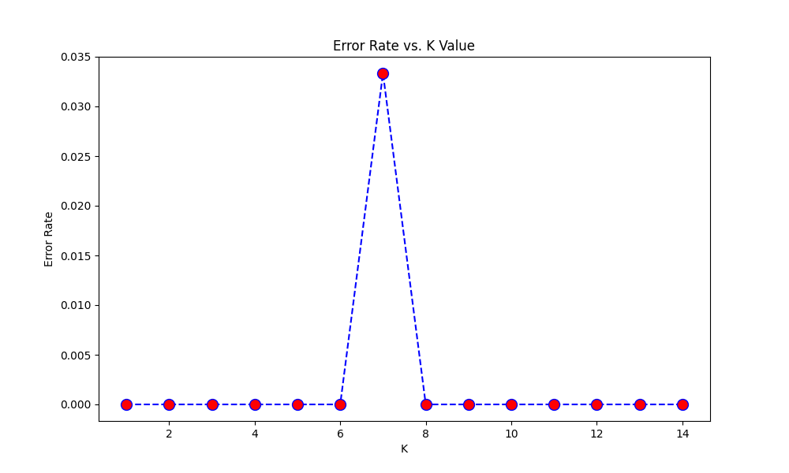
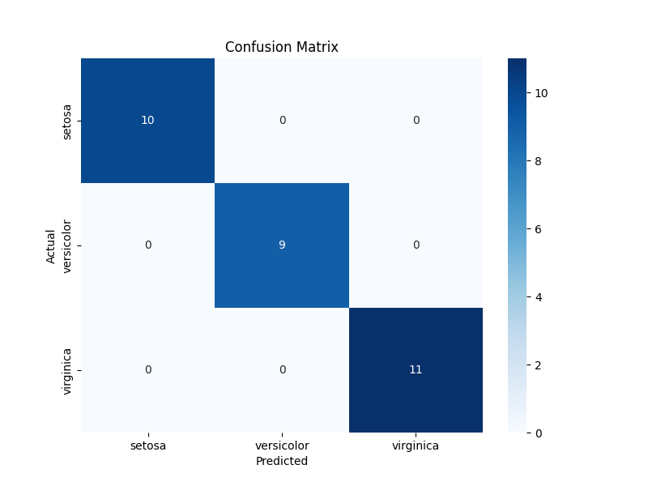

# KNN Classification for Iris Dataset - MLOps Project

This repository contains a full proof-of-concept project for a K-Nearest Neighbors (KNN) classifier, designed to showcase a complete MLOps workflow. The model is trained on the classic Iris dataset to classify species of iris flowers.

The project includes data preprocessing, model training, experiment tracking with **MLflow**, and a **FastAPI** endpoint for serving the model.

## About the KNN Algorithm

The K-Nearest Neighbors (KNN) algorithm is a simple, yet powerful, supervised machine learning algorithm used for both classification and regression tasks. It is a non-parametric, instance-based, and lazy learning algorithm.

-   **Instance-Based**: It doesn't learn a discriminative function from the training data but instead memorizes the training instances.
-   **Non-Parametric**: It makes no assumptions about the underlying data distribution.
-   **Lazy Learning**: It does no computation during the training phase. All the work happens during prediction, where it calculates the distance of a new data point to all training points.

To classify a new data point, the algorithm finds the 'K' closest training data points (the "neighbors") and assigns the new point to the class that is most common among its K neighbors.

### Mathematical Formulation

The "closeness" of points is determined by a distance metric. The most commonly used one is the **Euclidean Distance**.

Given two points, P1 with coordinates `(x1, y1)` and P2 with coordinates `(x2, y2)`, the Euclidean distance is calculated as:

`d(P1, P2) = sqrt((x2 - x1)^2 + (y2 - y1)^2)`

For n-dimensional space, the formula extends to:

`d(P, Q) = sqrt(sum_{i=1 to n} (qi - pi)^2)`

The algorithm calculates this distance between the new point and every point in the training set to find the nearest neighbors.

### Industry Use Cases

-   **Recommendation Systems**: Suggesting products or content to users based on the preferences of similar users (e.g., Netflix, Amazon).
-   **Anomaly Detection**: Identifying unusual patterns that do not conform to expected behavior, such as fraud detection in financial transactions.
-   **Image Recognition**: Classifying images by comparing a new image to a database of labeled images.
-   **Healthcare**: Predicting whether a patient has a certain disease based on their similarity to other patients.

## Project Structure

```
.
├── data/
│   └── dataset.csv         # The generated Iris dataset
├── images/
│   ├── elbow_plot.png      # Plot for finding the optimal K
│   └── confusion_matrix.png # Plot of the model's predictions
├── models/
│   └── knn_model.joblib    # The trained and saved KNN model
├── utils/
│   └── io_utils.py         # Utility functions (if any)
├── .gitignore
├── LICENSE
├── README.md               # Project documentation (this file)
├── requirements.txt        # Python dependencies
├── serve_fastapi.py        # FastAPI script to serve the model
└── train.py                # The main script for training the model
```

## Installation Guide

1.  **Clone the repository:**
    ```bash
    git clone <your-repo-url>
    cd <your-repo-name>
    ```

2.  **Create and activate a virtual environment (recommended):**
    ```bash
    python -m venv venv
    source venv/bin/activate  # On Windows, use `venv\Scripts\activate`
    ```

3.  **Install the required dependencies:**
    ```bash
    pip install -r requirements.txt
    ```

## How to Run the Project

### 1. Train the Model

Run the training script from the root directory of the project. This script will first generate the dataset, then run the training process, and log everything to MLflow.

```bash
python train.py
```

The script will output the model's performance and save the trained model, along with evaluation plots.

### 2. Track Experiments with MLflow

MLflow is used to track experiments, log parameters, metrics, and artifacts. To view the MLflow UI, run the following command in your terminal:

```bash
mlflow ui
```

This will start a local server, typically at `http://127.0.0.1:5000`. Open this URL in your browser to see the "KNN_Iris_Classification" experiment, compare runs, and view the logged artifacts (including the plots and the model itself).

### 3. Serve the Model with FastAPI

This project includes a `serve_fastapi.py` script to serve the trained model as a REST API. To run it, use `uvicorn`:

```bash
uvicorn serve_fastapi:app --reload
```

The API will be available at `http://127.0.0.1:8000`. You can access the interactive API documentation (provided by Swagger UI) at `http://127.0.0.1:8000/docs`.

## Results and Evaluation

The model's performance is evaluated using several metrics and visualizations, which are automatically generated and saved during the training process.

### Elbow Method for Optimal K

To find the best value for 'K', we use the Elbow Method. We plot the error rate for different values of K and look for the "elbow" point where the error rate starts to level off.



Based on this plot, we chose **K=5** as a good balance between model complexity and error rate.

### Confusion Matrix

The confusion matrix helps us visualize the performance of the classification model. It shows how many predictions were correct and how many were incorrect for each class.



This matrix shows that the model performs very well, with very few misclassifications on the test set.